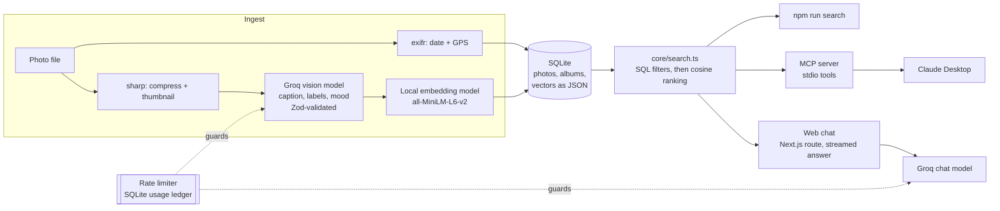

# Memory Lane

Chat with your photo library. Memory Lane captions every photo with a vision model, indexes the captions as vectors, and answers questions like *"what did I eat in Tokyo?"* with the actual photos cited inline. The same library is exposed as an **MCP server**, so Claude Desktop (or any MCP client) can search it and organise albums. It runs entirely on free tiers and local models: no paid services, no cloud storage.

<!-- Add docs/screenshot.png (see "Taking the screenshot" below), then uncomment this line:

-->

## What it does

- **Ingests photos**: compresses them, reads EXIF date and GPS, captions them with a vision model (validated with Zod), and embeds the caption locally.
- **Semantic search**: date and label filters run in SQL first, then cosine similarity ranks what's left. One `searchPhotos()` function serves the CLI, the web chat and the MCP server.
- **RAG chat with citations**: answers stream in and cite photos as `[photo:12]`, which render as clickable thumbnails. The cited frames get circled on the contact sheet. When nothing matches, the model says so instead of inventing photos.
- **Manage the library**: upload by button or drag-and-drop, open any photo for its details, and delete photos (with a confirmation step) from the photo view.
- **MCP server**: `search_photos`, `get_photo`, `list_labels`, `add_label`, `create_album`, `list_albums` over stdio.

## How it works



### Design decisions

- **One core, two front doors.** Everything that touches data or models lives in `core/`. The web routes and the MCP server are thin adapters, so retrieval is written once.
- **A free-tier rate limiter that can't be outrun.** Every Groq request is booked in a SQLite ledger *before* it's sent, then corrected to the real token count. Because the ledger is shared, the seed script, the web app and the MCP server can't jointly exceed the per-minute or per-day limits. The limiter waits when a minute is full and stops cleanly before the daily cap, rather than letting Groq reject the request.
- **Local embeddings.** Groq has no embedding API, so vectors come from `all-MiniLM-L6-v2` running in Node via transformers.js. Search, `add_label` re-indexing and the CLI cost nothing and work offline.
- **Errors before the stream.** The chat route waits for the model's first token before answering `200`, so a bad API key or a retired model shows up as a clear message instead of an empty reply.
- **Contact-sheet UI.** The gallery borrows from how photographers review film: numbered frames on a lightbox, with the chosen ones circled in red grease pencil. The frame number *is* the id the chat cites.

## Tech stack

| Layer | Choice |
|---|---|
| App | Next.js 16 (App Router), TypeScript (strict), Tailwind CSS 4 |
| Vision + chat | Groq free tier via the Vercel AI SDK (`qwen/qwen3.8-27b` for captions, `openai/gpt-oss-20b` for chat) |
| Embeddings | `all-MiniLM-L6-v2` (384-d) via `@huggingface/transformers`, running locally |
| Images / EXIF | `sharp`, `exifr` |
| Database | SQLite via `better-sqlite3` (WAL mode) |
| Validation | Zod (model output, API requests, MCP tool inputs) |
| MCP | `@modelcontextprotocol/sdk` over stdio |

## Setup

**Requirements:** Node.js 22 or newer (`nvm use` picks it up from `.nvmrc`), and a free Groq API key from [console.groq.com/keys](https://console.groq.com/keys) (no credit card needed).

```bash
git clone https://github.com/<you>/Memory-Lane.git
cd Memory-Lane
npm install
cp .env.example .env        # then paste your key after GROQ_API_KEY=
```

**Add photos**, either by bulk-importing a folder:

```bash
npm run seed -- ./sample-photos
```

or by uploading them from the web app. The first run downloads the embedding model (~25 MB, once).

**Run the app:**

```bash
npm run dev                 # http://localhost:3000
```

**Search from the terminal** (local only, uses no API budget):

```bash
npm run search -- "dog at the park"
npm run search -- "dinner" --label food --from 2024-01-01 --to 2024-12-31
```

### Free-tier limits

Captioning uses Groq's free tier, which allows about **2 photos per minute** and **roughly 100 photos per day**. The seed script prints the remaining daily budget before and after each run. If a batch hits the daily limit it stops cleanly; run it again later and photos already in the library are skipped.

iPhone **HEIC** photos aren't supported (sharp's prebuilt binaries can't decode HEVC). Export them as JPEG first, e.g. in Photos via *File → Export*, which can also keep location data.

## Use it from Claude Desktop (MCP)

Add this to `~/Library/Application Support/Claude/claude_desktop_config.json` (macOS), then restart Claude Desktop:

```json
{
  "mcpServers": {
    "memory-lane": {
      "command": "/ABSOLUTE/PATH/TO/node",
      "args": [
        "/ABSOLUTE/PATH/TO/Memory-Lane/node_modules/tsx/dist/cli.mjs",
        "/ABSOLUTE/PATH/TO/Memory-Lane/mcp/server.ts"
      ]
    }
  }
}
```

- Use **absolute paths everywhere**. Claude Desktop doesn't load your shell profile, so `npx` or an nvm-managed `node` usually isn't on its PATH. Get the path with `which node` (with Node 22 active).
- No `env` block is needed: the server reads the project's `.env` and resolves `DATA_DIR` relative to the project, whatever folder Claude Desktop starts it from.
- The MCP tools don't call Groq at all; search and re-indexing run locally.

To debug the server on its own:

```bash
npx @modelcontextprotocol/inspector npx tsx mcp/server.ts
```

Then try asking Claude: *"Search my photos for the beach and make an album called Summer from the best ones."*

## Project structure

```
core/          shared library: db, ai (Groq + local embeddings), ingest, search, ratelimit, types
app/           Next.js UI and API routes (chat, ingest, photos, image)
mcp/           MCP server (stdio)
scripts/       seed (bulk ingest) and search (CLI)
data/          created at runtime, gitignored: photos.db, images/, thumbs/
```

## Known limitations and next steps

- **Vector search is a linear scan** in TypeScript. It's fine for a few thousand photos; beyond that, swap `rankPhotos()` for [`sqlite-vec`](https://github.com/asg017/sqlite-vec) (the function is the only thing that would change).
- **No auth.** It's built to run locally. Don't expose it on a public server as is.
- **Local storage only.** Photos and the database live in `data/`.
- **Date filters use UTC dates**, so a photo taken late in the evening can land on the next day.
- **Evals.** A small set of queries with expected photo ids, scored as hit rate@k, would make prompt and retrieval changes measurable.
- **Ideas:** agent mode (the chat model calling `search_photos` as a tool), hybrid keyword + vector search, an "on this day" view, and an Ollama provider for fully offline captioning.

## Taking the screenshot

Seed a few varied photos, run `npm run dev`, ask a question that cites two or three photos, and capture the window once the red circles appear. Save it as `docs/screenshot.png`.

